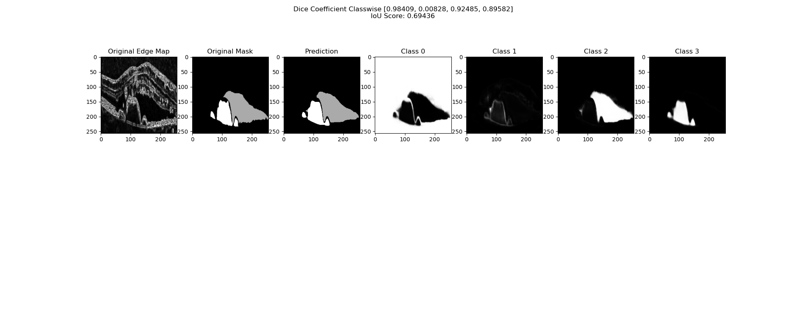

# OCT-Segmentation-Using-Semi-Supervised-Learning

## Overview

This project uses a semi-supervised learning approach for the semantic segmentation of medical images (OCT scans specifically).  In real life, it can prove to be difficult to obtain labeled medical scans and images.  Having a small amount of labeled data as a constraint for training can be overcome by using semi-supervised learning.

## Dataset

The RETOUCH dataset was used, which is available <a href="https://www.kaggle.com/datasets/saivikassingamsetty/retouch">here</a>.  The dataset contains Optical Coherence Tomography (OCT) scans from three different vendors with four classes (including the background).  The classes are as follows:  
Class 0: Background  
Class 1: Intra-retinal Fluid 
Class 2: Sub-retinal Fluid 
Class 3: Pigment Epithelial Detachment 

For this project, the “train_dataset” directory of images was used as the entire dataset (training and validation).  All the images and masks were read as grayscale, resized to 256x256, and only images were normalized. Linear interpolation was used for resizing both images and masks.  
The dataset was split into unlabeled, labeled, and validation sets (sizes 2148, 430, and 107 respectively).  The unlabeled batch size was set to 5 and the labeled batch size was set to 1.  This was done so that unlabeled and labeled training could happen simultaneously and due to memory limitations.  
Another point worth mentioning is that the images were not preprocessed according to the backbone and weights used (see Model), because the images contain a single channel and so it is not necessary.  Such preprocessing is required for RGB (or 3 channel) images.

## Model

Two different backbones were used as encoders for the UNet, namely ResNet50 and VGG19 (with batch-normalization).  The models were implemented using the <a href="https://github.com/qubvel/segmentation_models.pytorch">segmentation-models-pytorch</a> library.  The semi-supervised approach used was the <a href="https://arxiv.org/abs/1703.01780">Mean Teacher</a> model.  Both the student and teacher have the exact same architecture.  The encoders of the models were both initialized with imagenet weights.

## Training

A 1:1 combination of dice loss and focal loss was used for training, simply because it gave better results than just dice and a combination of dice and cross-entropy.  Following the paper on the mean teacher model, the EWMA parameter, alpha, was set to 0.99 for the ramp-up phase and 0.999 for training.  During ramp-up, alpha was made to decay as done in the <a href="https://github.com/CuriousAI/mean-teacher/tree/master/pytorch">original Mean Teacher implementation</a>.   
The Adam optimizer was used instead of the proposed SGD due to its faster convergence and better results.  The learning rate was initially set to 0.0001 and made to decay with a factor of 0.1 with respect to the training loss.  More details can be found in “main_notebook.ipynb.”  In addition, a weight decay of 0.0002 was used as done in the original Mean Teacher implementation.  
Both models were trained for a total of 200 epochs. The train logs for both models is available in their respective folders.  The train logs contain the running time for each epoch, training, and validation loss, and IoU score. 

## Results

The final results on the validation set are as follows:

VGG19 RESULTS (200): 

Final Test IoU: 0.6175590491016335 
Final Test Dice Score Classwise: [ 0.9830918423483305, 0.08740901165957356, 0.41739037627145936, 0.308281467418136 ] 
Final Test Dice Score : 0.4490431744243749 

RESNET50 RESULTS (200): 

Final Test IoU: 0.5814705385225956 
Final Test Dice Score Classwise: [ 0.9851030506820322, 0.04001523468846188, 0.4081623935208068, 0.25541135661183895 ] 
Final Test Dice Score : 0.42217300887578496 

The predictions made on all 107 validation images along with the dice coefficients and IoU score can be found in the resprective Results folders.  A sample comparision has been shown below:  
ResNet50 Sample (please click on the image for a larger view):  
  
VGG19 Sample (please click on the image for a larger view):  
 

One observation that can be made from the results is that the models fail to perform well on class 1, which consists of small, scattered spots whenever present in a scan.  One possible approach to improve this would be to use a weighted dice loss for training (not done in this project).

## Further Experimentation

The ensemble of these two models was also tested, however it has not been added to this repository.  VGG19 alone performed better than the ensemble with weights [0.8, 0.2], [0.7,0.3], [0.6,0.4], [0.5,0.5] for VGG19 and ResNet50 respectively. 
The models could be trained for longer to get better results since the losses did appear to not have stagnated. 
Other semi-supervised approaches such as FixMatch, MixMatch, etc. can also be used to get better results. 

## References

1. <a href="https://arxiv.org/abs/1703.01780">Original Paper on Mean Teacher</a>
2. <a href="https://github.com/CuriousAI/mean-teacher/tree/master/pytorch">Original Implementation of Mean Teacher in PyTorch
3. <a href="https://github.com/qubvel/segmentation_models.pytorch">Segmentation Models Library for PyTorch</a>
4. <a href="https://github.com/Lightning-AI/torchmetrics">Torchmetrics library source code</a>
5. <a href="https://pytorch.org/docs/stable/index.html">PyTorch Documentation</a>
